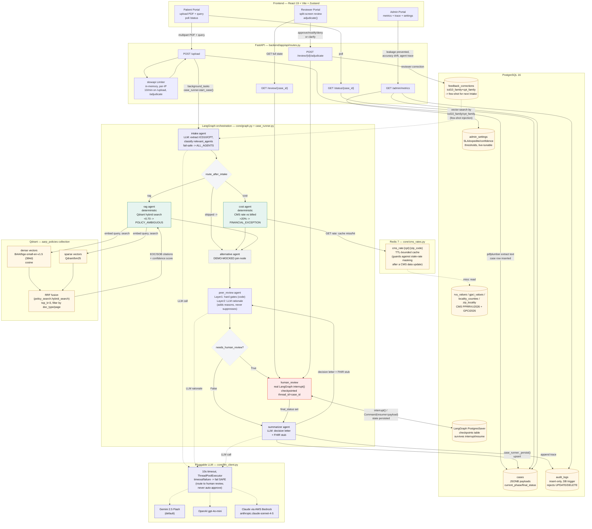

# AgenticPA

Multi-agent Prior Authorization system for UHG AARP Medicare — clinical RAG, financial benchmarking, human-in-the-loop review, and a self-improving feedback loop. Built for a hackathon: a tight, real, demoable end-to-end path over feature breadth. See `documents/FULL_DOCUMENTATION.md` for the full product/architecture spec.

## Architecture

- **Orchestration**: FastAPI + LangGraph (`PostgresSaver` checkpointer) with a real graph-level `interrupt` — the graph cannot transition Peer-Review → Summarizer while `needs_human_review == True`.
- **Agents**: Clinical Intake & Normalizer, AARP Medicare RAG (policy retrieval), Cost Intelligence & Benchmarking, Alternative Therapy Mapper (mocked), Peer-Review Compliance Auditor, Dual-Output Summarizer.
- **Data**: Qdrant (policy vectors), Redis (CMS rate cache), PostgreSQL (`cases`, `audit_logs`, `feedback_corrections`).
- **Frontend**: React 19 + TypeScript + Vite + Tailwind + Zustand + React Router — Patient Portal, Reviewer Portal (split-screen), Admin Portal.
- **LLM**: pluggable provider (`LLM_PROVIDER` = `gemini` | `openai` | `bedrock_claude`) used for extraction, translation, and reasoning/explainability only — never as the sole gate on a hard threshold. Deterministic hard-gates (cost variance, RAG similarity, intake confidence) live in code.

Repo layout:

```
backend/app/
├── agents/     # LangGraph nodes (intake, cost, rag, alternative, peer-review, summarizer)
├── core/       # AgenticPAState, graph builder, supervisor
├── db/         # Postgres models
├── api/        # FastAPI routes
└── utils/      # pdfplumber, case numbering
frontend/src/
├── pages/       # Patient, Reviewer, Admin
├── components/
└── store/       # Zustand
docker-compose.yml
```

## System Architecture (detailed)

End-to-end path of a single PA request across every service — frontend, FastAPI, LangGraph agents, Postgres, Redis, Qdrant, and the pluggable LLM layer.



**What each store is actually doing (not just "in the stack"):**

- **Postgres** carries three distinct workloads on one instance: the application's own tables (`cases`, `audit_logs` — insert-only via a DB trigger, `feedback_corrections`), reference data ingested verbatim from CMS files (`rvu_values`, `gpci_values`, `locality_counties`, `zip_locality`), **and** the LangGraph `PostgresSaver` checkpoint table that makes the `human_review` `interrupt()` durable across process restarts.
- **Redis** is a narrow, single-purpose TTL cache (`cms_rate:{cpt}:{zip_code}`) in front of the CMS rate lookup so `cost` agent calls don't recompute GPCI-adjusted rates from Postgres on every request — not a queue, not a session store, not a checkpointer here.
- **Qdrant** holds one collection (`aarp_policies`) with **both** a dense (BGE-small, cosine) and sparse (BM25) named vector per point, queried together and merged with Reciprocal Rank Fusion — a true hybrid-search setup, not a single embedding lookup.
- **LLM layer** is provider-agnostic (`generate_text`) and is deliberately kept off the decision path: it's used for extraction (Intake), free-text rationale (Peer-Review, additive only), and translation (Summarizer) — every hard gate (cost variance %, RAG similarity threshold, extraction confidence) is plain deterministic code, and any LLM timeout/failure fails safe into human review rather than silently approving.

See `documents/backend-workflow-diagram.md` for the LangGraph-only view (state schema + human-review sequence diagram) and `documents/FULL_DOCUMENTATION.md` for the full product spec.

## Prerequisites

- Docker (for Postgres, Redis, Qdrant)
- Python backend deps live in the conda env **`pa_hack`** — prefix backend commands with `conda run -n pa_hack`
- Node.js for the frontend

## Setup

```bash
cp .env.example .env       # fill in GEMINI_API_KEY and other secrets
cp frontend/.env.example frontend/.env
```

### 1. Infra only (recommended for local dev)

```bash
docker compose up -d postgres redis qdrant
```

### 2. Backend

```bash
cd backend
conda run -n pa_hack alembic upgrade head
conda run -n pa_hack python scripts/seed_hero_cases.py   # idempotent, safe to rerun
conda run -n pa_hack uvicorn app.main:app --reload --port 8000
```

Health check: `curl http://localhost:8000/health`

The `aarp_policies` Qdrant collection (used by the RAG agent) is populated
automatically on backend startup if it's missing or empty — no manual step
needed. To (re)run it by hand: `conda run -n pa_hack python -m app.utils.policy_ingest`.

### 3. Frontend

```bash
cd frontend
npm install
npm run dev   # http://localhost:5173
```

In dev mode the frontend calls the backend directly at `http://localhost:8000` (CORS is configured for `http://localhost:5173` via `FRONTEND_ORIGIN`).

### Full stack via Docker Compose

```bash
docker compose up --build
```

## Ports

| Service | Port |
|---|---|
| Backend | 8000 |
| Frontend | 5173 |
| Postgres | 5432 |
| Redis | 6379 |
| Qdrant | 6333 |

## Demo login (mocked auth)

Three hardcoded roles, credentials in `.env` / `frontend/.env`: `patient_demo`, `reviewer_demo`, `admin_demo`.

## Key API endpoints

| Method | Endpoint | Purpose |
|---|---|---|
| POST | `/api/v1/upload` | Upload PDF → returns `case_id` |
| GET | `/api/v1/status/{case_id}` | Poll current phase |
| GET | `/api/v1/review/{case_id}` | Full state for reviewer split-screen |
| POST | `/api/v1/review/{case_id}/adjudicate` | Submit reviewer decision + diffs |
| GET | `/api/v1/admin/metrics` | Leakage prevented + accuracy drift + agent trace |

## Notes

- Synthetic data only (Faker-generated) — no real PHI.
- Code marks `// DEMO-REAL` vs `// DEMO-MOCKED` on every agent/feature so mocked pieces (Alternative Therapy Mapper, Bias & Fairness Gauge, auth) are never oversold as live.
- `.env` is gitignored; only `.env.example` is committed.
