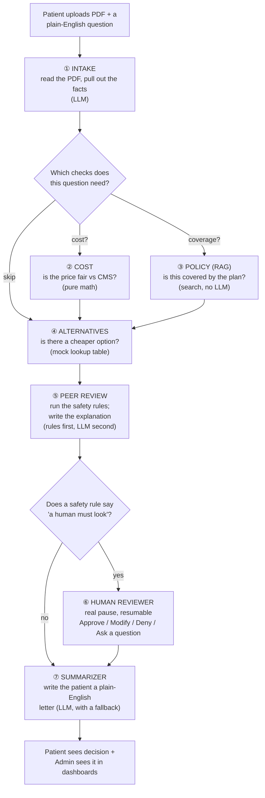

# Understand AgenticPA — Plain-English Guide + Q&A Prep

You built this system. This document is so you can *explain* it — to yourself first, then to
a technical reviewer, then to a leadership audience — without re-reading the code every time.

It has three parts:

1. **What each component does**, with a diagram and a worked example, in plain English.
2. **How the whole thing fits together** (one end-to-end story, using a real hero case).
3. **Question bank** — the questions you'll actually get asked, split by audience, with
   answers you can say out loud.

Everything here is grounded in the actual code (`backend/app/agents/`, `backend/app/core/`).
Nothing is invented. Where the system mocks something, this doc says so.

---

## Part 1 — The one-sentence version

> A patient uploads a prior-authorization request (a PDF). Six specialist "agents" — really
> just Python functions and one LLM call each, wired together in sequence — read it, price it,
> check it against the insurance policy, and decide whether a computer can safely approve/deny
> it or whether a human has to look. Every step leaves a paper trail.

Think of it like a hospital's prior-auth desk, except each "employee" only does one job and
never gets tired, and there's a security camera (the audit log) on every desk that nobody can
erase.

---

## Part 2 — The end-to-end flow (the diagram to have in your head)



Two things to say out loud whenever you present this:

- **The routing is per-question, not fixed.** If the patient only asked "is this covered?",
  the Cost agent may not even run. If Intake can't tell what was asked, it runs *everything* —
  it never silently skips a safety check.
- **The gate that sends a case to a human is 100% deterministic code, not an LLM opinion.**
  The LLM only gets to *add* reasons to escalate, never to wave a case through.

---

## Part 3 — Each component, one at a time

### ① Intake — the reader

**What it does:** Takes the raw PDF text + the patient's question. Calls an LLM once, with a
prompt that says "pull out these exact fields." Fields include patient name/DOB/ZIP, ICD-10
diagnosis codes, CPT procedure codes, the billed amount, and — importantly — a
**confidence score** for how sure it is about each field.

**Also does:** Reads the patient's question ("is this covered and is the price fair?") and
decides which of the three downstream checks (cost / policy / alternatives) are actually
relevant. This is the "query classification."

**Analogy:** A very fast, very literal paralegal who reads the file and fills out an intake
form — but who is honest enough to write "not sure" next to any field they're unsure of,
instead of guessing confidently.

**Safety behavior:** If the LLM call fails, times out, or returns garbage — Intake doesn't
crash and doesn't guess. It sets confidence to `0`, which *forces* human review downstream,
and marks *every* check as relevant (fails open to caution, not to speed).

**Self-improvement:** Every time a human reviewer corrects a field (says "actually the DOB is
wrong"), that correction is stored. Next time a similar diagnosis code comes through, Intake
is shown up to 3 past corrections as "don't make this mistake again" examples. This is a
lightweight few-shot loop, not model retraining.

**Worked example (hero case PA-104):** PDF says "upper GI endoscopy, CPT 43239, billed
$5,000." Intake extracts CPT 43239, ICD-10 code, billed amount $5,000, and rates its own
confidence at 0.90.

---

### ② Cost — the price-checker

**What it does:** Zero LLM. Pure arithmetic. Looks up the real CMS government rate for that
procedure code in that ZIP code, using the actual formula Medicare uses:

```
benchmark = (work_RVU × work_GPCI + practice_expense_RVU × PE_GPCI + malpractice_RVU × MP_GPCI) × $33.4009
```

RVU = "how much work/resource this procedure takes," GPCI = "how much more/less things cost in
this specific geography." This is not an estimate — it's the same formula CMS itself uses to
set physician payment rates, run against real government CSV files that are already loaded
into the database.

Then compares: `billed amount` vs `benchmark`. If billed is more than 20% over benchmark →
flag `FINANCIAL_EXCEPTION`. If the ZIP or CPT can't be resolved at all → flag
`RATE_UNAVAILABLE` (never silently assumes it's fine).

**Analogy:** A pricing-transparency tool, like checking a car repair quote against the
manufacturer's published labor-rate guide.

**Worked example (PA-104):** CMS benchmark for CPT 43239 in that locality = **$432.90**.
Billed = **$5,000.00**. Variance = **+1,055%**. Way past the 20% threshold →
`FINANCIAL_EXCEPTION` fires immediately.

---

### ③ Policy RAG — the coverage-checker

**What it does:** Also zero LLM (pure retrieval). Takes the diagnosis + procedure info, and
searches the *actual* AARP Medicare Evidence of Coverage document — the real plan document,
already chopped into chunks and indexed — using **hybrid search** (two search methods combined:
one that matches "what it means" and one that matches "the exact words," merged together for
better recall than either alone).

Every result comes back with a **page citation**. If the best match's confidence score is
below 0.70, or nothing matches at all, it flags `POLICY_AMBIGUOUS` — meaning "I'm not
confident this is clearly covered or clearly excluded, a human should read the actual page."

**Analogy:** Ctrl+F over the insurance policy PDF, but smart enough to find "joint
replacement" when the document says "arthroplasty," and honest about how sure it is.

**Why "RAG"?** RAG = Retrieval-Augmented Generation. Here it's mostly just the "Retrieval"
half — the system does *not* ask an LLM to interpret the policy text; it just finds the
relevant page and confidence score. That's a deliberate choice: retrieval is deterministic and
auditable; letting an LLM interpret ambiguous policy language would not be.

---

### ④ Alternatives — the "is there a cheaper option" agent

**What it does:** A small hardcoded lookup table (3 entries today) mapping some diagnosis+
procedure combos to a cheaper, clinically-reasonable alternative — e.g., knee osteoarthritis +
total knee replacement → a conservative injection first. This part is explicitly **mocked** —
it's not a real clinical-guidelines engine, and the code says so in comments
(`// MVP-MOCKED`).

**What's real about it:** once it suggests an alternative, the *savings number* is computed
using the same real CMS pricing math as the Cost agent. So the mapping is illustrative, the
dollar figure attached to it is not.

**Why be upfront about this:** because a leadership audience will ask "is that AI deciding
clinical alternatives?" — the honest answer is no, today it's a lookup table with real pricing
math bolted on, and the roadmap item is to replace the lookup table with a real
clinical-guidelines source.

---

### ⑤ Peer Review — the safety gate (the most important component)

Two layers, in strict order:

**Layer 1 — hard gates (pure code, no LLM, cannot be talked out of):**

| Flag | Fires when |
|---|---|
| `LOW_CONFIDENCE_EXTRACTION` | Intake's confidence is missing or below 0.85 |
| `FINANCIAL_EXCEPTION` | Cost agent found billed > 20% over CMS benchmark |
| `RATE_UNAVAILABLE` | Cost agent couldn't resolve a benchmark rate at all |
| `POLICY_AMBIGUOUS` | RAG's top match confidence was below 0.70 |

If **any** of these fire, `needs_human_review = True`. That's it. No LLM is involved in this
decision — it's `if`/`else` code you can read top to bottom.

**Layer 2 — rationale (LLM, but only writes prose, doesn't gate):** Once the hard-gate result
is already locked in, an LLM writes a human-readable explanation citing the actual numbers
("billed $5,000 vs benchmark $432.90, variance +1,055%..."). It's *allowed* to say "I also
think this should escalate for reason X" — but that can only ever **add** a reason, never
remove one that Layer 1 already set. If the LLM call fails outright, the hard-gate result
still stands and a generic fallback message is shown instead.

**This is the answer to "how do you make sure the AI doesn't approve something it shouldn't":**
the approve/deny-worthy decision is never made by an LLM. It's made by four numeric/threshold
checks in plain code. The LLM's job is strictly translation — turning "flags fired" into
readable English — never adjudication.

---

### ⑥ Human Review — the actual decision-maker for flagged cases

When a hard gate fires, the case doesn't just sit in a queue — the workflow engine
(LangGraph) does a **real pause** (`interrupt()`), checkpointed into Postgres. That means:

- The process can crash and restart, and the case resumes exactly where it paused.
- A reviewer sees a split-screen: the original PDF, the extracted fields (editable, each with
  a confidence badge), and the rationale panel (why it was flagged, cost breakdown, policy
  citations).
- Reviewer actions: **Approve**, **Modify & Approve** (edits get saved as corrections that
  feed Intake's few-shot loop), **Deny** (requires a written reason), or **Request
  Clarification** (loops back to the same pause point rather than creating a new case).

**Analogy:** Not a ticket that gets requeued — think of it as the process being *asleep*, and
a nurse's note being able to wake it back up at the exact same spot.

---

### ⑦ Summarizer — the patient-facing writer

**What it does:** LLM call that writes a plain-English decision letter, explicitly targeting
a readability score (Flesch Reading Ease > 60 — roughly "an average adult reads this
comfortably on the first pass," not insurance-legalese). If the LLM fails, or its own output
scores too low on readability, a deterministic template letter is used instead — the patient
never gets a blank page, and never gets denied a decision because of an LLM hiccup.

Also produces a mocked FHIR-shaped record (illustrative healthcare-data-interop structure —
not validated against the real FHIR spec, clearly labeled as a stand-in for a future real
integration).

---

### Supporting systems (worth naming, not full agents)

- **SLA & Expedite** (`supervisor.py`) — every case gets a deadline (default 48h); if you're
  within 2h of the deadline (or past it), it's flagged "expedite," shown as a live countdown to
  the patient.
- **Admin-tunable settings** — SLA hours, expedite window, the 0.85 confidence threshold, and
  which agents are even turned on are all editable by an admin, live, without a redeploy.
- **Audit log** — every agent action is written to an insert-only table — the database itself
  (not just the app code) rejects any `UPDATE`/`DELETE` on it via a trigger. This is the "you
  can't rewrite history" guarantee.
- **Bias & Fairness Gauge** (`fairness.py`) — covered in detail in Part 4 below, since it's a
  near-guaranteed leadership question.

---

## Part 4 — Fairness & "LLM as judge": the two questions everyone asks

### 4.1 Bias & Fairness Gauge — what it actually is

It is a **dashboard, not a control**. It looks at every *finalized* case (approved or denied)
and buckets it two independent ways:

- **Age** (from date of birth) → 4 Medicare-relevant bands: Under 65, 65-74, 75-84, 85+.
- **Region** (from the first digit of ZIP code) → 4 coarse US regions (Northeast/South/
  Midwest/West).

For each bucket with **3 or more** finalized cases, it reports an approval rate. Buckets with
fewer than 3 cases are **dropped entirely**, not shown with an asterisk — because a 1-of-1
bucket reporting "0%" or "100%" is noise, not signal, and a dashboard that shows noise as if it
were a finding is worse than a dashboard that shows nothing.

**The one sentence that matters:** *this gauge has zero wiring into the decision pipeline.*
`fairness.py` is never imported by the code that actually adjudicates a case. It cannot route a
case to review, and it cannot change an outcome. It only answers "in aggregate, looking
backward, does approval rate differ by these two coarse proxies?" — for a human compliance
reviewer to investigate if it does.

**Why not wire it in?** Two reasons, and both are good answers if asked "why doesn't the
system correct for this automatically":
1. Adjusting one patient's individual outcome based on their *cohort's* aggregate stats would
   itself be a demographic-based decision — just an invisible, automatic one instead of a
   disclosed one. That's a worse failure mode, not a better one.
2. The only data available are two weak proxies (age, coarse ZIP region) — there's no race,
   sex, income, or disability data captured anywhere. Building an automatic "correction" on
   top of two weak proxies would manufacture false confidence that the system is
   "bias-corrected," when it hasn't been validated as such.

**So what *does* protect against a biased outcome?** The Peer Review hard gates (Part 3, ⑤) —
and pointedly, those four flags never look at demographics at all. They look only at evidence
quality: how confident was the extraction, how far off was the price, how strong was the
policy match. The fairness gauge asks "is there disparity in the aggregate?"; the hard gates
ask "is this specific case well-evidenced enough to auto-decide?" They're deliberately
separate systems answering deliberately separate questions.

### 4.2 "Is there an LLM-as-judge here?"

Short answer: **not the classic pattern, and that's deliberate.**

"LLM-as-judge" usually means: one LLM produces an output, and a *second* LLM call scores or
grades that output against some rubric, and that grade is used to accept/reject/rank it. This
system does **not** do that anywhere. There is no LLM call whose job is "grade another LLM's
output."

What it does instead, and why the distinction matters:

- Every place quality/correctness needs to be judged, the judge is **deterministic code**, not
  an LLM: the 20%-variance threshold, the 0.70 policy-match threshold, the 0.85
  confidence threshold. These thresholds are visible, testable, and admin-tunable — you can
  point at the exact line of code, which you cannot do with an LLM's internal judgment.
- The one place an LLM's *own* output is checked is the Summarizer: it runs a real,
  non-LLM readability formula (Flesch Reading Ease) against the letter it wrote, and if the
  letter fails that bar, a deterministic template is substituted. That's "checking an LLM's
  output with a formula," not "checking an LLM's output with another LLM."
- The closest thing to a "judge" is Peer Review's Layer 2 (the rationale LLM) — but its output
  is never used to accept or reject anything; it's restricted to *prose explanation* plus the
  ability to *add* an escalation flag, never remove one Layer 1 already set.

**If asked "why not use LLM-as-judge for something like policy ambiguity?"** — a fair answer:
an LLM judging "is this policy match good enough" would itself be a second unauditable
opinion stacked on the first one. A numeric similarity-score threshold is falsifiable,
reproducible, and doesn't need its own evaluation harness. The system trades a small amount of
judgment nuance for a large amount of auditability — a defensible trade for a
compliance-sensitive domain like PA adjudication.

**If leadership specifically wants an LLM-as-judge pattern added later** (e.g., grading
rationale quality, or auto-scoring reviewer-vs-model agreement for a model-quality dashboard),
that is a reasonable roadmap item — but frame it as *new scope*, not something silently already
happening.

---

## Part 5 — Question bank

### Technical audience

**Q: What happens if the LLM call times out or returns malformed JSON?**
Every LLM call site has an explicit failure path. Intake: confidence drops to 0 and all agents
are marked relevant (forces review, never skips checks). Peer Review's rationale: hard gates
already fired stand regardless; a fallback error string is shown instead of a rationale.
Summarizer: falls back to a deterministic template letter. Nowhere does an LLM failure produce
a silent auto-approval.

**Q: How is the human-review pause actually implemented — is it just a status flag and a
queue poll?**
No — it's a real LangGraph `interrupt()`, checkpointed to Postgres via `PostgresSaver`, keyed
by `case_id` as the thread ID. The process can be killed and restarted and the case resumes at
the exact node. "Clarify" and "provider responded" re-enter the *same* interrupt point rather
than creating a new node or losing state.

**Q: Why do cost and policy checks run in parallel instead of sequentially?**
They're independent evidence sources with no data dependency on each other, so they execute in
the same LangGraph superstep (true parallel fan-out) and join at the Alternatives node before
Peer Review runs. Reduces latency without changing the decision logic.

**Q: How do you keep the audit trail from being altered after the fact?**
`audit_logs` is insert-only at the database level — a Postgres trigger rejects `UPDATE` and
`DELETE` statements outright. It's not just "the app doesn't expose an edit button"; the
database itself refuses the operation.

**Q: What's actually mocked vs real, precisely?**
Three things, explicitly commented `// MVP-MOCKED` in code: the Alternative Therapy lookup
table (3 hardcoded entries), the FHIR stub's schema fidelity (illustrative shape, not spec-
validated), and the 3 hardcoded MVP login identities (no real auth/IAM yet). Everything else —
CMS cost math, policy retrieval, hard-gate logic, fairness cohort computation, SLA logic, the
feedback loop — runs on real logic against real (synthetic, non-PHI) data, commented
`// MVP-REAL`.

**Q: How does the system prevent "confidence" from being gamed — e.g., an LLM always
reporting 0.95?**
It doesn't cryptographically prevent it today — this is a real gap worth naming rather than
hiding. Today confidence is self-reported by the extraction LLM. The mitigation in place is
that the confidence threshold is admin-tunable (so it can be raised if drift is observed) and
every reviewer correction is logged — an emerging accuracy-drift signal (`accuracy_drift` on
`/admin/metrics`) can be compared against reported confidence over time. A stronger mitigation
would be calibrating confidence against ground truth periodically — currently a roadmap item,
not implemented.

### Leadership / business audience

**Q: What business problem does this actually solve, in one line?**
Prior authorization today is slow, inconsistent, and undocumented — reviewers make case-by-
case judgment calls with no price benchmark and no cited policy evidence. This system gives
every case a real price check, a real policy citation, and a full audit trail, before it ever
reaches a human — and only sends a human the cases that actually need judgment.

**Q: What's the actual dollar/time impact?**
The system doesn't invent this number — it's demonstrated on hero cases, e.g. PA-104: a
$5,000 billed claim benchmarked against the real CMS rate of $432.90 (a >1000% variance),
flagged and routed to a human automatically instead of being missed. The pitch is "leakage
prevented" (dollars caught before payout) and reviewer time saved by pre-packaging evidence
instead of asking a human to gather it — both are live metrics on the Admin Portal
(`leakage_prevented`, `accuracy_drift`), not projections.

**Q: Does the AI ever make the final call alone?**
Only for cases where every deterministic check passes clean — no cost exception, no policy
ambiguity, no low-confidence extraction. The moment any one of those numeric thresholds is
tripped, a human reviewer is put in the loop and the case *cannot* proceed to a final decision
without that human action. This is enforced by the workflow engine pausing execution, not by a
policy or convention that could be skipped.

**Q: How do we know it isn't biased against certain patients?**
Two separate things, worth stating as two things: (1) A monitoring dashboard tracks approval-
rate differences by age band and region, built from real outcomes, refusing to report any
group under 3 cases (to avoid mistaking noise for a finding). (2) Separately, and more
importantly, the actual per-case safety checks never look at age, region, or any demographic
signal at all — they look only at price variance, policy match strength, and extraction
confidence. So the system's real defense against a biased outcome doesn't depend on
demographic monitoring catching it after the fact — it's structurally blind to demographics in
the first place.

**Q: Is this using AI to just deny more claims / cut costs at the patient's expense?**
The cost check flags claims *priced above* the government benchmark — i.e., it catches
overcharging, and it flags it for human review rather than auto-denying it. Nothing in the
pipeline auto-denies; the strictest thing an automated flag can do is force a human to look
before any denial is issued.

**Q: What's not production-ready yet — what should we not oversell?**
Stated directly in the code and worth saying directly in the room: authentication is 3
hardcoded demo logins, not real SSO/IAM; the Alternatives agent's clinical mapping is an
illustrative 3-entry table, not a guidelines engine; the FHIR output is a shape, not a
certified integration; and the fairness gauge is a monitoring surface, not a bias-correction
mechanism. None of these are hidden — each is labeled in code comments and this doc names them
so they can be talked about proactively instead of being found by a skeptical question.

**Q: What would it take to go from MVP to a real pilot?**
Real auth to replace the mocked logins, a real clinical-guidelines source behind Alternatives,
a multi-payer policy corpus (today it's one insurer's coverage document), a certified FHIR
integration, and load-tested horizontal scaling of the workflow engine. The architecture
itself — stateless API + checkpointed workflow + managed data stores — doesn't need a rewrite
to get there; these are additive, not structural, changes.

---

## Part 6 — Glossary (say these plainly, don't assume the room knows them)

| Term | Plain meaning |
|---|---|
| Hard gate | A yes/no rule written in code — not an opinion — that forces human review |
| RVU / GPCI | Government units for "how much work a procedure takes" / "how much more things cost in this location" — the building blocks of the real Medicare price formula |
| RAG | Retrieval-Augmented Generation — here, mostly just "search the real policy document and cite the page," with no LLM interpreting the policy language |
| Interrupt / checkpoint | The workflow engine's ability to truly pause a case mid-flight and resume it later at the exact same point, even after a restart |
| Cohort | A group of cases sharing an age band or region, only reported if it has 3+ finalized cases |
| MVP-REAL / MVP-MOCKED | Code-level labels distinguishing real logic on real data from illustrative stand-ins |
| Confidence threshold | The 0.85 bar Intake's self-reported confidence must clear, or the case is forced to human review |
