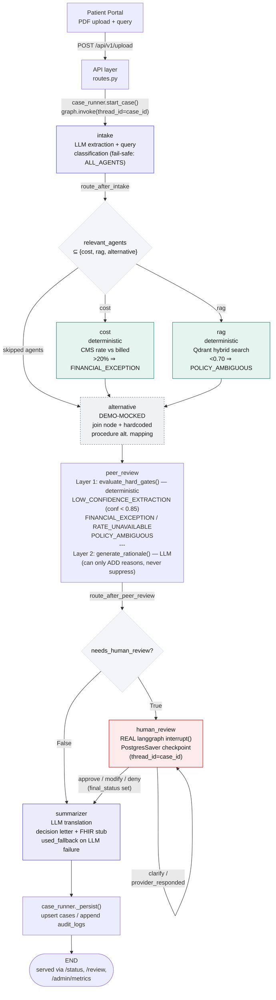
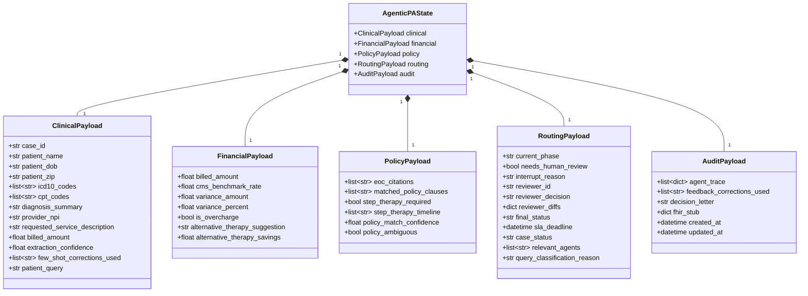
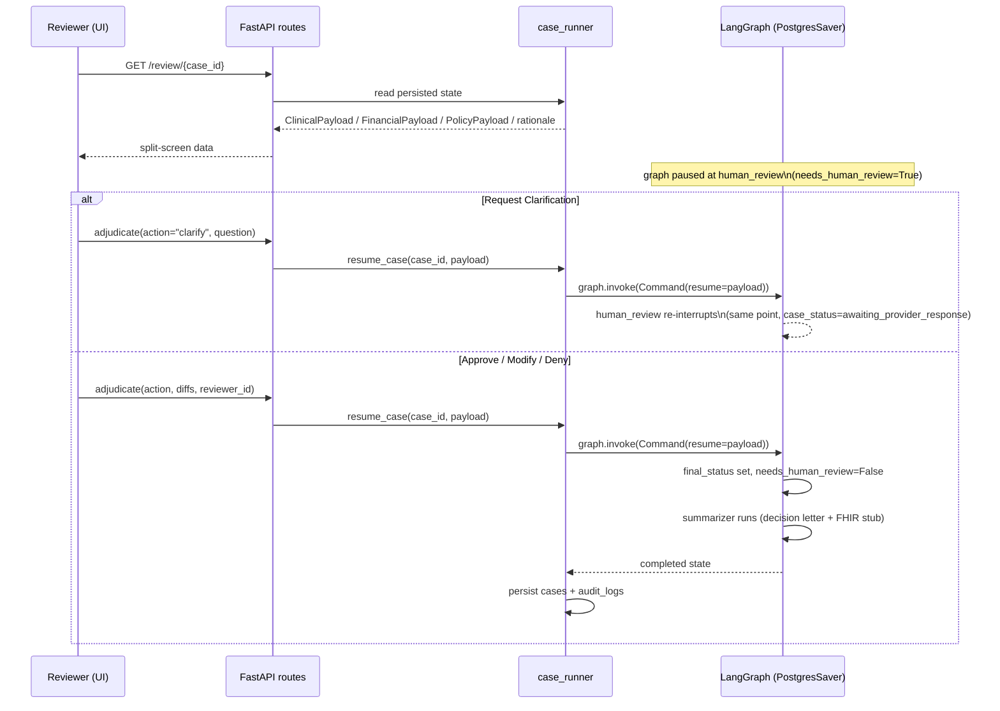

# AgenticPA — Backend Workflow (Mermaid)

Source of truth: `backend/app/core/graph.py`, `core/case_runner.py`, `core/state.py`,
`agents/peer_review_agent.py`, `agents/cost_agent.py`, `agents/rag_agent.py`.

## 1. LangGraph flowchart

**Reading notes**

- `route_after_intake` and `relevant_agents` are a **routing hint only** — any
  classification failure fails safe to running every agent. It never suppresses
  a safety check, only skips work judged unnecessary.
- `cost` and `rag` execute in the same LangGraph superstep (true parallel
  fan-out); their audit-trace entries are folded in at the `alternative` join
  node because a Pydantic state channel accepts one write per step.
- `needs_human_review` is set **entirely** by `peer_review`'s deterministic
  Layer 1 before any LLM call runs. Layer 2 (LLM) can only add escalation
  reasons — it can never flip a fired hard gate back to auto-approve, and if
  it fails/times out, the hard-gate result still stands.
- `human_review` is a genuine graph-level `interrupt()`, checkpointed to
  Postgres — the graph cannot physically reach `summarizer` while
  `needs_human_review=True`. "Request Clarification" and "Provider Responded"
  loop back to the *same* interrupt point rather than creating a new node.

---

## 2. State schema (UML class diagram)

---

## 3. Human-review interrupt lifecycle (sequence diagram)

